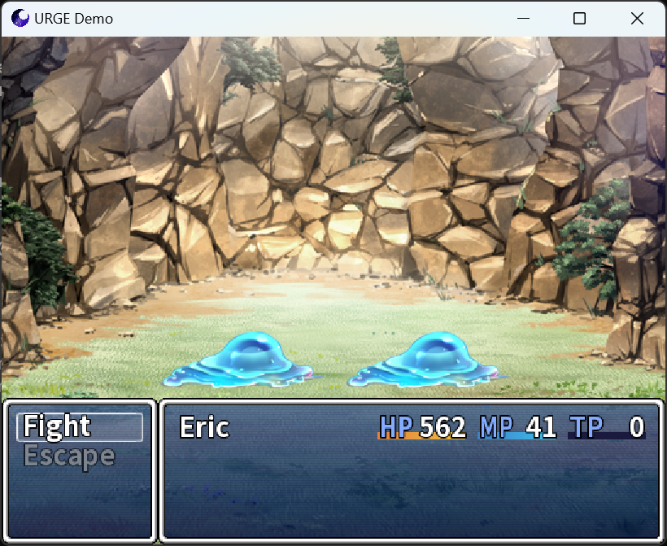
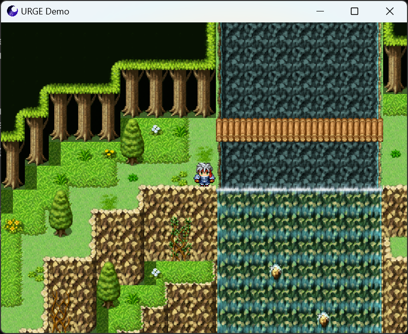
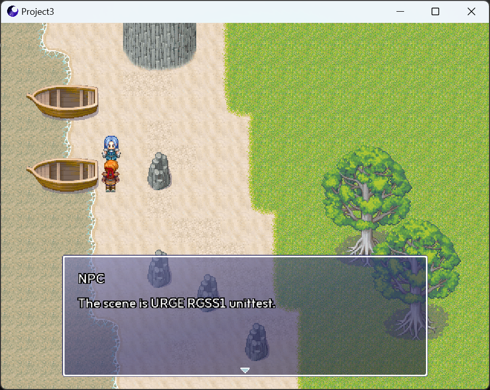
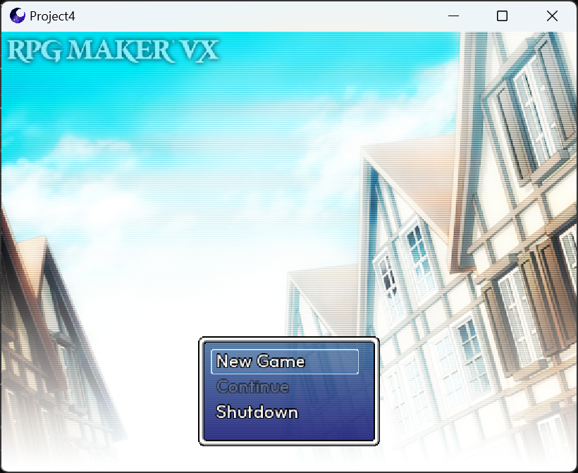
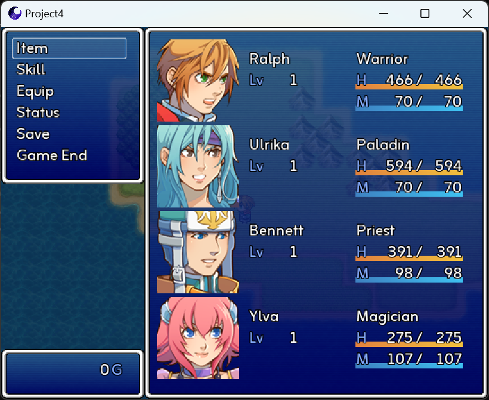

#  通用Ruby游戏引擎 (URGE)

## 语言选择
- [English](README_EN.md)
- [简体中文](README.md)

## 概览

 - URGE 是一款兼容 RGSS 1/2/3 系的 2D/3D 游戏引擎。
 - 使用了 SDL3 作为底层库，支持运行于 Windows, Linux, Android, WASM/Emscripten 等平台。
 - 使用了 DiligentCore 作为渲染RHI，提供了 D3D12/Vulkan 等现代API的支持。  
 - 本项目使用 BSD-2-Clause 许可证开源。  
 - 项目风格来自 The Chromium Project。  
 - 项目启发于 Chromium，RGModern。  
 
## 截图








## 构建方式

### 准备环境

1. CMake ≥ 3.20  
2. Python ≥ 3.0  
3. Ruby ≥ 1.8
4. Vulkan SDK ≥ 1.1.0  
5. NASM ≥ 2.14 (Windows)  
6. MSVC ≥ 2015 + Clang GNU/CLI (Windows)  
7. Ninja ≥ 1.10 (Optional)  

### 开始编译

1. 递归拉取源码
```
git clone --recursive https://github.com/Admenri/urge.git
```
2. 执行构建脚本
```
cmake -S . -B out
```
3. 执行编译
```
cmake --build out --target Game
```

## 第三方库

### 包含于项目源码中
### third_party
- asio - https://github.com/chriskohlhoff/asio  
- dav1d - https://github.com/videolan/dav1d  
- SDL_image - https://github.com/libsdl-org/SDL_image  
- imgui - https://github.com/ocornut/imgui  
- miniaudio - https://github.com/mackron/miniaudio  
- physfs - https://github.com/icculus/physfs  
- spine-runtimes - https://github.com/EsotericSoftware/spine-runtimes  
- SDL_ttf - https://github.com/libsdl-org/SDL_ttf  
### base/third_party
- concurrentqueue - https://github.com/cameron314/concurrentqueue  
- inih - https://github.com/benhoyt/inih  
- magic_enum - https://github.com/Neargye/magic_enum  
- rapidxml - https://rapidxml.sourceforge.net/  
### binding/mri/third_party
- fiddle - https://github.com/ruby/fiddle  
- libffi - https://github.com/libffi/libffi  
- ruby - https://github.com/ruby/ruby  
- ruby_prof - https://github.com/ruby-prof/ruby-prof  

### 外部引用
### third_party
- DiligentCore - https://github.com/DiligentGraphics/DiligentCore  
- freetype - https://github.com/freetype/freetype  
- libwebp - https://github.com/webmproject/libwebp  
- mimalloc - https://github.com/microsoft/mimalloc  
- ogg - https://github.com/xiph/ogg  
- opus - https://github.com/xiph/opus  
- opusfile - https://github.com/xiph/opusfile  
- SDL3 - https://github.com/libsdl-org/SDL  
- spdlog - https://github.com/gabime/spdlog  
- vorbis - https://github.com/xiph/vorbis  
- zlib - https://github.com/madler/zlib  

## 联系方式

- 邮箱: admenri@qq.com  
- 网站: https://admenri.com/  

© 2015-2025 Admenri
