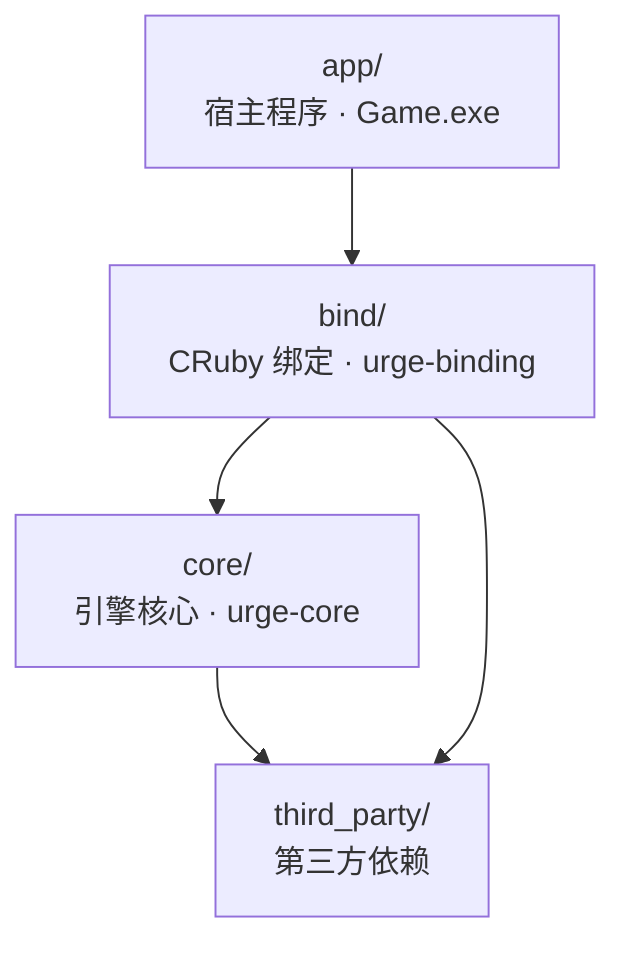
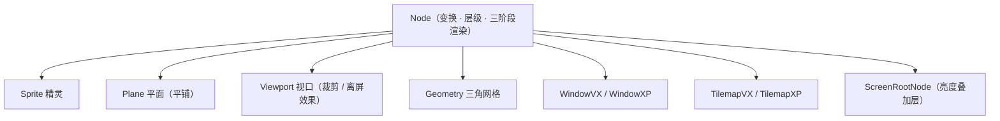
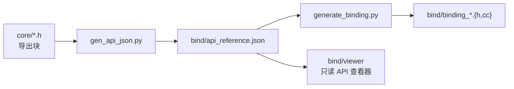

# URGE Core

**Universal Ruby Game Engine** · 基于 WebGPU 的 RGSS 运行时

[English](README_EN.md) | 简体中文

<br clear="left" />

---

## 1. 概览

**URGE（Universal Ruby Game Engine）** 是一个面向 Windows 平台的 RGSS（Ruby Game
Scripting System）运行时实现。引擎以现代 C++（C++20）从头编写，使用 WebGPU 作为硬件
加速的图形后端，并兼容 RPG Maker XP（RGSS1）、VX（RGSS2）与 VX Ace（RGSS3）三代脚本
API——既有工程原则上无需改动脚本即可运行。

引擎以 C++ 实现全部运行时设施（窗口、渲染、输入、音频、字体、文件系统），通过自动生成
的绑定层把这些原生对象暴露给内嵌的 CRuby 解释器；脚本侧看到的仍是 `Bitmap`、`Sprite`、
`Viewport`、`Graphics` 等熟悉的 RGSS 常量。

### 主要特性

| 特性 | 说明 |
| --- | --- |
| RGSS1 / 2 / 3 兼容 | 依据 `Game.ini` 的 `RGSS` 字段或脚本归档扩展名自动判定版本 |
| WebGPU 渲染后端 | 基于 wgpu-native，渲染目标统一为 `RGBA8Unorm`，present 阶段做 sRGB 补偿 |
| 3D 变换节点树 | 统一的 `Node` 基类，支持父子层级、位置/旋转/缩放与 Z 排序 |
| 自定义着色器效果 | `Effect` 可将任意 GLSL 片元着色器挂载到节点或其子树上 |
| 内嵌 CRuby | 直接执行 RPG Maker 的脚本归档（Marshal + zlib），无需外部 Ruby 环境 |
| 自动绑定生成 | 由 `core/*.h` 的导出块机械生成 CRuby 胶水，签名即契约 |
| 高像素密度适配 | 逻辑分辨率与物理像素解耦，高分屏下按系统缩放显示 |
| 虚拟文件系统 | 通过 PhysicsFS 统一装载脚本、资源与 RTP 路径 |

### 技术栈

| 组件 | 来源 | 用途 |
| --- | --- | --- |
| 语言 | C++20 | 引擎与宿主 |
| 窗口 / 输入 / 音频 | SDL3、SDL_image、SDL_ttf | 平台抽象、位图解码、字体栅格化 |
| 图形 API | WebGPU（wgpu-native） | 渲染后端 |
| 着色器工具链 | glslang + SPIRV-Tools + spirv-reflect | GLSL → SPIR-V 编译与描述符布局反射 |
| 脚本运行时 | CRuby 1.9.3（`third_party/cruby`） | 执行 RGSS 脚本 |
| 虚拟文件系统 | PhysicsFS（physfs） | 资源与 RTP 装载 |
| 数学库 | glm | 向量、矩阵与投影 |
| 压缩 | zlib | 脚本归档解压 |

### 目录结构

```
urge/
├── app/              宿主程序
│   ├── app.cc        入口：按序初始化各单例，随后进入脚本层
│   ├── platform/     平台相关实现（Win32 RTP 路径探测等）
│   └── resources/    应用图标与 Windows 版本资源
├── core/             引擎核心：与脚本无关的全部运行时设施
├── bind/             CRuby 绑定：自动生成的胶水 + 手写运行时层
│   └── viewer/       基于 IR 的只读 API 查看器
├── third_party/      第三方依赖（多数为 Git 子模块）
├── test/             测试
└── CMakeLists.txt
```

---

## 2. 构建

### 环境要求

| 项目 | 要求 |
| --- | --- |
| 操作系统 | **Windows 10 1809 及以上（x64）**。wgpu 在 Windows 上默认使用 DX12 后端，因此不支持 Windows 7 / 8 |
| 编译器 | Visual Studio 2022 或更新版本（MSVC，需支持 C++20） |
| 构建系统 | CMake ≥ 3.30 |
| Rust | stable 工具链（wgpu-native 通过 Corrosion 由 Cargo 构建） |
| 版本控制 | Git（依赖以子模块形式提供） |

### 获取与构建

```bash
git clone --recursive https://github.com/Admenri/urge.git
cd urge
cmake -S . -B build
cmake --build build --config Release --target Game
```

> `--recursive` 是必需的。全部第三方依赖以子模块或内嵌形式存在，缺失时 CMake 会在配置
> 阶段直接失败。

产物位于：

- Release：`build/app/Release/Game.exe`
- Debug：`build/app/Debug/Game.exe`

### 增量构建注意事项

`core/` 与 `bind/` 均以 `file(GLOB ...)` 收集源文件，CMake 会在**配置期**冻结该文件
列表。因此：

- **新增或删除源文件后**，需重新执行一次 `cmake -S . -B build`；否则新文件不会被编译，
  或在链接阶段报 `LNK2019` / `LNK2001`。
- 仅修改已有文件的内容时，直接 `cmake --build` 即可，无需重新配置。

### 运行

将 `Game.exe` 放入游戏工程目录（即包含 `Game.ini` 与 `Data/` 的目录）后直接运行。引擎以
可执行文件所在目录为工作目录，并按 `<可执行文件名>.ini` 读取配置。

`Game.ini` 示例：

```ini
[Game]
RGSS = 3
Scripts = Data/Scripts.rvdata2
Title = My Game
; RTP / RTP1 / RTP2 / RTP3 可选；Windows 下会自动探测已安装的运行库

[Window]
Width = 640
Height = 480

[Audio]
Soundfont = Fonts/Default.sf2

[GFX]
Backend =
```

配置项说明：

| 段 | 键 | 默认值 | 说明 |
| --- | --- | --- | --- |
| `Game` | `RGSS` | `0`（自动） | `1` = XP、`2` = VX、`3` = VX Ace；为 `0` 时按 `Scripts` 扩展名推断 |
| `Game` | `Scripts` | `Data/Scripts.rxdata` | 脚本归档路径 |
| `Game` | `Title` | `(*^▽^*)` | 窗口标题 |
| `Game` | `RTP` / `RTP1`–`RTP3` | 空 | RPG Maker 运行库名称 |
| `Window` | `Width` / `Height` | XP：`640x480`，其余：`544x416` | 逻辑分辨率 |
| `Audio` | `Soundfont` | `Fonts/Default.sf2` | MIDI 音色库 |
| `GFX` | `Backend` | 空（自动） | wgpu 后端选择 |

### 第三方依赖

以下依赖以 Git 子模块形式提供，需在克隆时一并拉取：

| 子模块 | 用途 |
| --- | --- |
| `glm` | 数学库 |
| `SDL` | 窗口、输入、音频与平台抽象 |
| `SDL_image` | 位图解码 |
| `SDL_ttf` | TrueType 字体栅格化（内含 FreeType / HarfBuzz / PlutoSVG） |
| `physfs` | 虚拟文件系统 |
| `glslang` | GLSL → SPIR-V 编译 |
| `SPIRV-Tools` | SPIR-V 工具链 |
| `wgpu-native` | WebGPU 实现（Rust） |
| `zlib` | 脚本归档解压 |

此外，`third_party/` 下还有四个**内嵌**依赖（非子模块）：`cruby`（CRuby 1.9.3）、
`libffi`（外部函数调用接口，为 `Win32API` 绑定提供 x64 下的 ABI 调用）、`spirv-reflect`
（描述符布局反射）与 `webgpu-cpp`（WebGPU C++ 头文件包装）。

`libffi` 仅在 Windows 上参与构建（见 `third_party/CMakeLists.txt`）：它的唯一消费者是
`bind/binding_win32api.cc`，而该绑定在非 Windows 平台编译为空实现。它的构建脚本是上游
autotools 工程（`configure.ac` / `configure.host` / `Makefile.am`）的 CMake 逐行翻译，
而非重新设计。

---

## 3. 架构

### 分层

整个工程分为四层，依赖方向自上而下、单向：


```mermaid
graph TD
  A["app/<br/>宿主程序 · Game.exe"] --> B["bind/<br/>CRuby 绑定 · urge-binding"]
  B --> C["core/<br/>引擎核心 · urge-core"]
  C --> D["third_party/<br/>第三方依赖"]
  B --> D
```

- **`app/`** —— 宿主程序。`app.cc` 是唯一入口：解析可执行路径与 `Game.ini`，按依赖顺序
  初始化 `IOService`、`Config`、`Input`、`Mouse`、`FontContext`、`Graphics` 等单例，
  随后进入 `binding::BindingMain`；退出时按逆序释放。
- **`bind/`** —— CRuby 绑定静态库。它依赖 `urge-core` 但不含入口点；宿主负责
  `ruby_init()` 之后调用 `binding::InitBindings()`。
- **`core/`** —— 引擎核心，编译为静态库 `urge-core`，完全不含任何 Ruby 依赖。
- **`third_party/`** —— 以子模块或内嵌形式提供的全部外部依赖。

### 渲染管线

图形后端为 WebGPU（wgpu-native）。引擎仅使用一种渲染目标格式 `RGBA8Unorm`；交换链若为
`*Srgb` 格式，present 阶段用一个片元着色器做**精确的分段 sRGB 反编码**，使 sRGB 目标的
再编码相互抵消，从而在任意交换链格式下还原作者意图的颜色。

着色器以 **GLSL** 编写，构建期由 glslang 编译为 SPIR-V，并由 spirv-reflect 反射出描述符
布局；绑定的集合（set）约定为：

| Set | 内容 |
| --- | --- |
| 0 | 场景级 uniform（屏幕尺寸、投影等） |
| 1 | 逐绘制对象 uniform（动态偏移，来自共享池） |
| 2 | 纹理与采样器 |
| 3 | 逐节点的参数（如精灵的颜色/色调/不透明度） |

为降低每帧的 CPU 开销，引擎采用两项批次化设计：

- **uniform 池**（`core/uniform.h`）：把一帧中同类逐绘制数据集中写入少数大缓冲区，以
  `dynamic offset` 寻址，取代"每个绘制对象一个缓冲区"。
- **帧顶点批**（`core/primitive.{h,cc}`）：整个帧共享一个顶点缓冲区，每个绘制对象以
  `firstVertex` 定位自己的顶点区间，把每帧数百次 `WriteBuffer` 压缩为一次。

一帧的推进顺序为：

```
SDL_AppIterate
  └─ Graphics::Update
       ├─（提交准备阶段：分配 uniform 槽位、追加顶点、Flush 上传）
       ├─ Node::Render（对屏幕纹理执行渲染通道）
       ├─ FPS 控制（FrameSkip / Delay）
       └─ PresentInternal（把屏幕纹理绘制到交换链）
```

### 节点树

所有可视对象统一继承自 `Node`，以侵入式双向链表（`DrawableSet`）维护父子关系，并支持
位置、四元数旋转与缩放的 3D 变换。`Node::Render` 以固定顺序驱动**三个阶段**：

| 阶段 | 职责 | 门控关系 |
| --- | --- | --- |
| `Prepare` | 追加几何到帧顶点批、写入 uniform | 返回 `true` 才会执行 `DoDraw` |
| `DoDraw` | 绑定管线/资源并发起绘制 | 返回 `true` 才会执行 `PostDraw` |
| `PostDraw` | 绘制后的收尾（如后处理、裁剪栈弹出） | — |

> 注意：**几何必须在 `Prepare` 阶段全部生成**——帧顶点批在两阶段之间上传，在 `DoDraw`
> 里追加的顶点不会被提交。

节点类型与 RGSS 概念的对应关系：


```mermaid
graph TD
  N["Node（变换 · 层级 · 三阶段渲染）"] --> S["Sprite 精灵"]
  N --> P["Plane 平面（平铺）"]
  N --> V["Viewport 视口（裁剪 / 离屏效果）"]
  N --> G["Geometry 三角网格"]
  N --> W["WindowVX / WindowXP"]
  N --> T["TilemapVX / TilemapXP"]
  N --> R["ScreenRootNode（亮度叠加层）"]
```

其中 `Tilemap` 与 `Window` 会按 `Game.ini` 中判定的 RGSS 版本分别绑定到 `TilemapVX` /
`TilemapXP` 与 `WindowVX` / `WindowXP`，从而在脚本侧呈现与目标版本一致的常量。

### 绑定生成

`core/` 中带 `/*-export.begin-*/` … `/*-export.end-*/` 标记的类会被导出到 Ruby。整条链路
只读取 `core/*.h`，不修改任何引擎源码，也不依赖 CRuby VM 的私有结构：


```mermaid
flowchart LR
  H["core/*.h<br/>导出块"] --> G["gen_api_json.py"]
  G --> IR["bind/api_reference.json"]
  IR --> B["generate_binding.py"]
  B --> C["bind/binding_*.{h,cc}"]
  IR --> V["bind/viewer<br/>只读 API 查看器"]
```

该流程在 **CMake 配置期自动触发**（`bind/gen_binding.cmake`），并且两个生成器都遵循
**"先比较、后写入"** 的原则：内容未变时不触碰磁盘，从而不改变生成物的 mtime，也就不会
触发多余的重新编译。新增一个导出类只需在 `gen_api_json.py` 的 `CLASS_ORDER` 中登记一次，
随后执行 `cmake -S . -B build` 即可。

### 当前 Ruby API 一览

| 类别 | 数量 | 名称 |
| --- | --- | --- |
| 类 | 21 | `Disposable`、`Node`、`Geometry`、`Bitmap`、`Color`、`Font`、`Palette`、`Plane`、`Rect`、`Sprite`、`Table`、`Tone`、`Vector2`、`Vector3`、`Vector4`、`TilemapVX`、`TilemapXP`、`Viewport`、`WindowVX`、`WindowXP`、`Effect` |
| 模块 | 4 | `Graphics`、`Input`、`Audio`、`Mouse` |

### 核心模块地图

| 文件 | 职责 |
| --- | --- |
| `graphics.{h,cc}` | 主循环、窗口与交换链、present、转场、快照、帧率控制 |
| `node.{h,cc}` | 节点基类与三阶段渲染派发 |
| `drawable.{h,cc}` | 可绘制对象的侵入式链表（`DrawableSet`） |
| `sprite` / `plane` / `viewport` / `geometry` | 主要节点实现 |
| `window_vx` / `window_xp` / `tilemap_vx` / `tilemap_xp` | RGSS 窗口与元件节点 |
| `bitmap.{h,cc}` | 位图、GPU 纹理以及 `Blt` / 渐变 / 文字等绘制操作 |
| `gpu.{h,cc}` | wgpu 设备与队列封装、校验层日志回调 |
| `gpuwrapper.{h,cc}` | 把 wgpu 对象图导出到 Ruby |
| `pipeline.{h,cc}` / `shader.{h,cc}` | 渲染管线与着色器系统 |
| `primitive.{h,cc}` | 帧顶点批（`PrimitiveEmitter` / `QuadVertexManager`） |
| `uniform.{h,cc}` | 逐帧 uniform 池（`UniformBlockPool` / `UniformManager`） |
| `effect.{h,cc}` | 自定义着色器效果 |
| `font{,_context}.{h,cc}` | SDL_ttf 字体加载、渲染与文本度量 |
| `input.{h,cc}` / `mouse.{h,cc}` | 键盘与鼠标输入 |
| `audio.{h,cc}` | BGM / BGS / SE 等音频播放 |
| `filesystem.{h,cc}` | 基于 PhysicsFS 的虚拟文件系统与 RTP 路径 |
| `config.{h,cc}` / `inirw.{h,cc}` | `Game.ini` 解析 |
| `palette` / `table` / `utility` | RGSS 数据类型与值类型（`Color` / `Tone` / `Rect` / `Vector2/3/4`） |
| `object.h` / `refptr.h` / `disposable.h` | 引用计数、单例与生命周期基础设施 |
| `logger.h` | 分级日志（Debug 含位置，Release 自动裁剪） |

---

<div align="center">
  <sub>Licensed under the <a href="LICENSE.txt">MIT License</a> · Copyright (c) 2026 Admenri Adev</sub>
</div>
