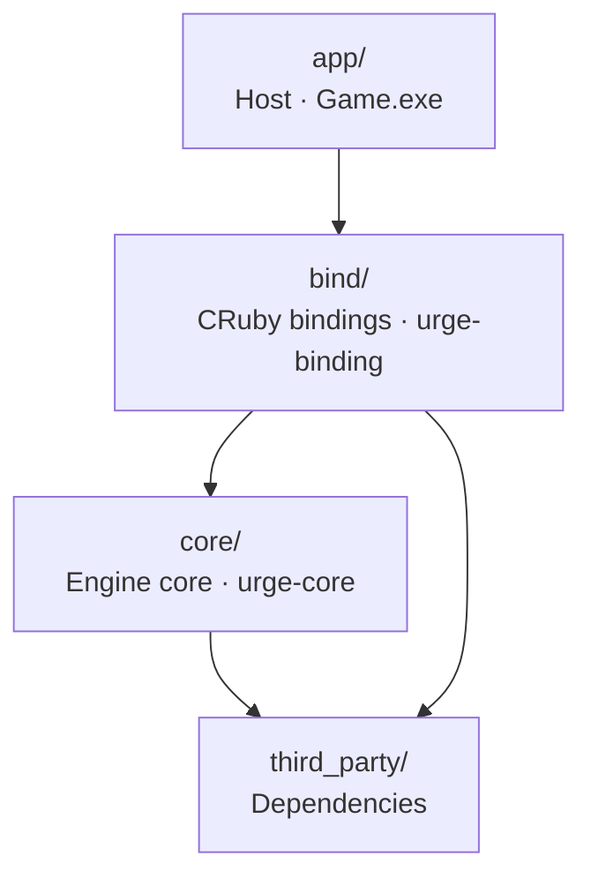
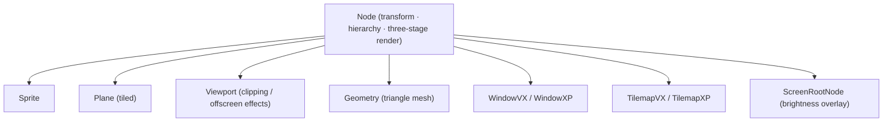
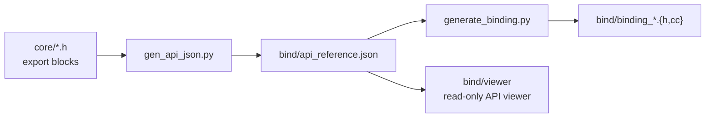

# URGE Core

**Universal Ruby Game Engine** · an RGSS runtime built on WebGPU

English | [简体中文](README.md)

<br clear="left" />

---

## 1. Overview

**URGE (Universal Ruby Game Engine)** is an RGSS (Ruby Game Scripting System) runtime
for Windows. It is written from scratch in modern C++ (C++20), uses WebGPU as its
hardware-accelerated graphics backend, and is compatible with the scripting APIs of
RPG Maker XP (RGSS1), VX (RGSS2) and VX Ace (RGSS3) — existing projects generally run
without any script changes.

Every runtime facility (window, rendering, input, audio, fonts, filesystem) is
implemented in C++ and exposed to an embedded CRuby interpreter through an
automatically generated binding layer. From the script's point of view the familiar
RGSS constants — `Bitmap`, `Sprite`, `Viewport`, `Graphics`, and so on — are still
what you work with.

### Highlights

| Feature | Description |
| --- | --- |
| RGSS1 / 2 / 3 compatible | The version is derived from the `RGSS` key in `Game.ini`, or inferred from the archive extension |
| WebGPU backend | Built on wgpu-native; every render target is `RGBA8Unorm` and the present pass compensates for sRGB |
| 3D transform node tree | A single `Node` base class with parent/child hierarchy, position/rotation/scale and Z ordering |
| Custom shaders | `Effect` attaches an arbitrary GLSL fragment shader to a node or to a subtree |
| Embedded CRuby | Runs RPG Maker script archives (Marshal + zlib) directly, with no external Ruby installation |
| Generated bindings | The CRuby glue is mechanically generated from the export blocks in `core/*.h`; signatures are the contract |
| High pixel density | Logical resolution is decoupled from physical pixels, so the window scales correctly on HiDPI displays |
| Virtual filesystem | Scripts, assets and RTP paths are mounted through PhysicsFS |

### Technology stack

| Component | Source | Purpose |
| --- | --- | --- |
| Language | C++20 | Engine and host |
| Window / input / audio | SDL3, SDL_image, SDL_ttf | Platform abstraction, image decoding, font rasterisation |
| Graphics API | WebGPU (wgpu-native) | Rendering backend |
| Shader toolchain | glslang + SPIRV-Tools + spirv-reflect | GLSL → SPIR-V compilation and descriptor-layout reflection |
| Scripting runtime | CRuby 1.9.3 (`third_party/cruby`) | Executes RGSS scripts |
| Virtual filesystem | PhysicsFS (physfs) | Asset and RTP mounting |
| Math | glm | Vectors, matrices, projections |
| Compression | zlib | Script-archive decompression |

### Repository layout

```
urge/
├── app/              Host program
│   ├── app.cc        Entry point: initialises the singletons, then enters the script layer
│   ├── platform/     Platform-specific code (Win32 RTP path discovery, etc.)
│   └── resources/    Application icons and Windows version resource
├── core/             Engine core: all runtime facilities, independent of any script
├── bind/             CRuby bindings: generated glue plus a hand-written runtime layer
│   └── viewer/       Read-only API viewer built on the IR
├── third_party/      Third-party dependencies (mostly Git submodules)
├── test/             Tests
└── CMakeLists.txt
```

---

## 2. Building

### Requirements

| Item | Requirement |
| --- | --- |
| Operating system | **Windows 10 1809 or newer (x64)**. wgpu defaults to the DX12 backend on Windows, so Windows 7 / 8 are not supported |
| Compiler | Visual Studio 2022 or newer (MSVC, with C++20 support) |
| Build system | CMake ≥ 3.30 |
| Rust | A stable toolchain (wgpu-native is built from Cargo via Corrosion) |
| Version control | Git (dependencies are provided as submodules) |

### Clone and build

```bash
git clone --recursive https://github.com/Admenri/urge.git
cd urge
cmake -S . -B build
cmake --build build --config Release --target Game
```

> `--recursive` is required. Every third-party dependency is either a submodule or
> vendored in-tree; when they are missing, CMake fails during configuration.

The artifacts are written to:

- Release: `build/app/Release/Game.exe`
- Debug: `build/app/Debug/Game.exe`

### Incremental builds

Both `core/` and `bind/` collect their sources with `file(GLOB ...)`, and CMake freezes
that file list at **configure time**. Therefore:

- **After adding or removing a source file**, re-run `cmake -S . -B build`. Otherwise the
  new file is never compiled, or the link step fails with `LNK2019` / `LNK2001`.
- When only the *contents* of existing files change, a plain `cmake --build` is enough —
  no re-configure is needed.

### Running

Place `Game.exe` in the game project directory (the one containing `Game.ini` and
`Data/`) and launch it. The engine uses the executable's directory as its working
directory and reads configuration from `<executable-name>.ini`.

Example `Game.ini`:

```ini
[Game]
RGSS = 3
Scripts = Data/Scripts.rvdata2
Title = My Game
; RTP / RTP1 / RTP2 / RTP3 are optional; installed runtimes are auto-detected on Windows

[Window]
Width = 640
Height = 480

[Audio]
Soundfont = Fonts/Default.sf2

[GFX]
Backend =
```

Configuration keys:

| Section | Key | Default | Description |
| --- | --- | --- | --- |
| `Game` | `RGSS` | `0` (auto) | `1` = XP, `2` = VX, `3` = VX Ace; when `0`, inferred from the `Scripts` extension |
| `Game` | `Scripts` | `Data/Scripts.rxdata` | Path to the script archive |
| `Game` | `Title` | `(*^▽^*)` | Window title |
| `Game` | `RTP` / `RTP1`–`RTP3` | empty | RPG Maker runtime names |
| `Window` | `Width` / `Height` | XP: `640x480`, otherwise `544x416` | Logical resolution |
| `Audio` | `Soundfont` | `Fonts/Default.sf2` | MIDI soundfont |
| `GFX` | `Backend` | empty (auto) | wgpu backend selection |

### Third-party dependencies

These dependencies are provided as Git submodules and must be fetched while cloning:

| Submodule | Purpose |
| --- | --- |
| `glm` | Math library |
| `SDL` | Window, input, audio and platform abstraction |
| `SDL_image` | Image decoding |
| `SDL_ttf` | TrueType rasterisation (bundles FreeType / HarfBuzz / PlutoSVG) |
| `physfs` | Virtual filesystem |
| `glslang` | GLSL → SPIR-V compilation |
| `SPIRV-Tools` | SPIR-V toolchain |
| `wgpu-native` | WebGPU implementation (Rust) |
| `zlib` | Script-archive decompression |

In addition, `third_party/` contains three **vendored** dependencies (not submodules):
`cruby` (CRuby 1.9.3), `spirv-reflect` (descriptor-layout reflection) and `webgpu-cpp`
(the WebGPU C++ header wrapper).

---

## 3. Architecture

### Layers

The project is organised into four layers with a strictly top-down dependency
direction:


```mermaid
graph TD
  A["app/<br/>Host · Game.exe"] --> B["bind/<br/>CRuby bindings · urge-binding"]
  B --> C["core/<br/>Engine core · urge-core"]
  C --> D["third_party/<br/>Dependencies"]
  B --> D
```

- **`app/`** — the host program. `app.cc` is the only entry point: it resolves the
  executable path and `Game.ini`, initialises the `IOService`, `Config`, `Input`,
  `Mouse`, `FontContext` and `Graphics` singletons in dependency order, then enters
  `binding::BindingMain`; on shutdown it releases them in reverse order.
- **`bind/`** — the CRuby binding static library. It depends on `urge-core` but contains
  no entry point; the host calls `binding::InitBindings()` after `ruby_init()`.
- **`core/`** — the engine core, built as the static library `urge-core`, with no
  dependency on Ruby of any kind.
- **`third_party/`** — all external dependencies, as submodules or vendored copies.

### Rendering pipeline

The graphics backend is WebGPU (wgpu-native). The engine uses exactly one render-target
format, `RGBA8Unorm`. When the swapchain is an `*Srgb` format, the present pass runs a
fragment shader that performs an **exact piecewise sRGB inverse encoding**, which cancels
the sRGB target's own encode and reproduces the authored colour on any swapchain format.

Shaders are authored in **GLSL**, compiled to SPIR-V by glslang at build time, and
reflected by spirv-reflect to derive the descriptor layout. The bind-group convention is:

| Set | Contents |
| --- | --- |
| 0 | Scene-level uniforms (screen size, projection, …) |
| 1 | Per-drawable uniforms (dynamic offset, from a shared pool) |
| 2 | Texture and sampler |
| 3 | Per-node parameters (e.g. a sprite's colour / tone / opacity) |

To cut per-frame CPU cost, the engine batches in two places:

- **Uniform pools** (`core/uniform.h`): the per-drawable data of a frame is packed into a
  few large buffers and addressed with a `dynamic offset`, instead of one buffer per
  drawable.
- **Frame vertex batch** (`core/primitive.{h,cc}`): the whole frame shares a single vertex
  buffer; each drawable addresses its own range with `firstVertex`, collapsing hundreds of
  `WriteBuffer` calls per frame into one.

The per-frame sequence is:

```
SDL_AppIterate
  └─ Graphics::Update
       ├─ (prepare stage: allocate uniform slots, append vertices, flush the upload)
       ├─ Node::Render (a render pass over the screen texture)
       ├─ FPS control (FrameSkip / Delay)
       └─ PresentInternal (draw the screen texture to the swapchain)
```

### Node tree

Every visible object derives from a single `Node` base class. Parent/child relationships
are held in an intrusive doubly-linked list (`DrawableSet`), and each node carries a 3D
transform (position, quaternion rotation, scale). `Node::Render` drives **three stages**
in a fixed order:

| Stage | Responsibility | Gating |
| --- | --- | --- |
| `Prepare` | Append geometry to the frame batch, write uniforms | Returning `true` is required for `DoDraw` |
| `DoDraw` | Bind pipeline/resources and issue draws | Returning `true` is required for `PostDraw` |
| `PostDraw` | Post-draw work (post-processing, popping the scissor stack) | — |

> Note: **geometry must be emitted entirely in `Prepare`** — the frame batch is uploaded
> between the two stages, so vertices appended in `DoDraw` are never submitted.

How the node types map onto RGSS concepts:


```mermaid
graph TD
  N["Node (transform · hierarchy · three-stage render)"] --> S["Sprite"]
  N --> P["Plane (tiled)"]
  N --> V["Viewport (clipping / offscreen effects)"]
  N --> G["Geometry (triangle mesh)"]
  N --> W["WindowVX / WindowXP"]
  N --> T["TilemapVX / TilemapXP"]
  N --> R["ScreenRootNode (brightness overlay)"]
```

`Tilemap` and `Window` are bound to `TilemapVX` / `TilemapXP` and `WindowVX` / `WindowXP`
respectively, according to the RGSS version detected from `Game.ini`, so scripts see the
constant that matches their target version.

### Binding generation

Classes in `core/` marked with `/*-export.begin-*/` … `/*-export.end-*/` are exported to
Ruby. The pipeline reads only `core/*.h`; it neither modifies the engine sources nor
depends on CRuby VM internals:


```mermaid
flowchart LR
  H["core/*.h<br/>export blocks"] --> G["gen_api_json.py"]
  G --> IR["bind/api_reference.json"]
  IR --> B["generate_binding.py"]
  B --> C["bind/binding_*.{h,cc}"]
  IR --> V["bind/viewer<br/>read-only API viewer"]
```

This pipeline runs automatically during the **CMake configure step**
(`bind/gen_binding.cmake`), and both generators follow a **"compare first, write second"**
rule: when the content is unchanged they never touch the disk. The generated files keep
their mtime, so no spurious recompilation is triggered. Adding an exported class therefore
takes a single registration in `gen_api_json.py`'s `CLASS_ORDER`, followed by
`cmake -S . -B build`.

### Current Ruby API surface

| Category | Count | Names |
| --- | --- | --- |
| Classes | 21 | `Disposable`, `Node`, `Geometry`, `Bitmap`, `Color`, `Font`, `Palette`, `Plane`, `Rect`, `Sprite`, `Table`, `Tone`, `Vector2`, `Vector3`, `Vector4`, `TilemapVX`, `TilemapXP`, `Viewport`, `WindowVX`, `WindowXP`, `Effect` |
| Modules | 4 | `Graphics`, `Input`, `Audio`, `Mouse` |

### Core module map

| File(s) | Responsibility |
| --- | --- |
| `graphics.{h,cc}` | Main loop, window and swapchain, present, transitions, snapshots, frame-rate control |
| `node.{h,cc}` | Node base class and three-stage render dispatch |
| `drawable.{h,cc}` | Intrusive list of drawables (`DrawableSet`) |
| `sprite` / `plane` / `viewport` / `geometry` | Main node implementations |
| `window_vx` / `window_xp` / `tilemap_vx` / `tilemap_xp` | RGSS window and element nodes |
| `bitmap.{h,cc}` | Bitmaps, GPU textures, and drawing operations such as `Blt`, gradients and text |
| `gpu.{h,cc}` | wgpu device/queue wrapper and validation-layer log callback |
| `gpuwrapper.{h,cc}` | Exposes the wgpu object graph to Ruby |
| `pipeline.{h,cc}` / `shader.{h,cc}` | Render pipelines and the shader system |
| `primitive.{h,cc}` | Frame vertex batch (`PrimitiveEmitter` / `QuadVertexManager`) |
| `uniform.{h,cc}` | Per-frame uniform pools (`UniformBlockPool` / `UniformManager`) |
| `effect.{h,cc}` | Custom shader effects |
| `font{,_context}.{h,cc}` | SDL_ttf font loading, rendering and text metrics |
| `input.{h,cc}` / `mouse.{h,cc}` | Keyboard and mouse input |
| `audio.{h,cc}` | BGM / BGS / SE playback |
| `filesystem.{h,cc}` | PhysicsFS-based virtual filesystem and RTP paths |
| `config.{h,cc}` / `inirw.{h,cc}` | `Game.ini` parsing |
| `palette` / `table` / `utility` | RGSS data types and value types (`Color` / `Tone` / `Rect` / `Vector2/3/4`) |
| `object.h` / `refptr.h` / `disposable.h` | Reference counting, singletons and lifetime infrastructure |
| `logger.h` | Levelled logging (with source location in Debug, stripped in Release) |

---

<div align="center">
  <sub>Licensed under the <a href="LICENSE.txt">MIT License</a> · Copyright (c) 2026 Admenri Adev</sub>
</div>
