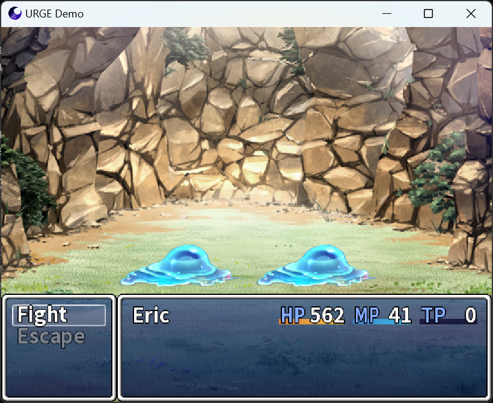

#  Universal Ruby Game Engine (URGE)

## Language selection
- [English](README_EN.md)
- [简体中文](README.md)

## Overview

- URGE is a 2D/3D game engine compatible with the RGSS 1/2/3 API.
- It uses SDL3 as the underlying library and supports platforms such as Windows, Linux, Android, and WASM/Emscripten.
- It leverages DiligentCore as the rendering RHI, providing support for modern APIs like D3D12 and Vulkan.
- This project is open-source under the BSD-2-Clause license.
- The project style is inspired by The Chromium Project.
- It is inspired by Chromium and RGModern.

## Screenshots





## Build Instructions

### Environment

1. CMake ≥ 3.20  
2. Python ≥ 3.0  
3. Ruby ≥ 1.8
4. Vulkan SDK ≥ 1.1.0  
5. NASM ≥ 2.14 (Windows)  
6. MSVC ≥ 2015 + Clang GNU/CLI (Windows)  
7. Ninja ≥ 1.10 (Optional)  

### Building

1. Execute the clone command:
   ```
   git clone --recursive https://github.com/Admenri/urge.git
   ```
2. Execute the build script:
   ```
   cmake -S . -B out
   ```
3. Execute the compilation:
   ```
   cmake --build out --target Game
   ```

## Third-Party Libraries

### Included in the Project Source Code
### third_party
- asio - https://github.com/chriskohlhoff/asio  
- dav1d - https://github.com/videolan/dav1d  
- SDL_image - https://github.com/libsdl-org/SDL_image  
- imgui - https://github.com/ocornut/imgui  
- miniaudio - https://github.com/mackron/miniaudio  
- physfs - https://github.com/icculus/physfs  
- SDL_ttf - https://github.com/libsdl-org/SDL_ttf  
### base/third_party
- concurrentqueue - https://github.com/cameron314/concurrentqueue  
- inih - https://github.com/benhoyt/inih  
- magic_enum - https://github.com/Neargye/magic_enum  
- rapidxml - https://rapidxml.sourceforge.net/  
### binding/mri/third_party
- fiddle - https://github.com/ruby/fiddle  
- libffi - https://github.com/libffi/libffi  
- ruby - https://github.com/ruby/ruby  
- ruby_prof - https://github.com/ruby-prof/ruby-prof  

### External References
### third_party
- DiligentCore - https://github.com/DiligentGraphics/DiligentCore  
- freetype - https://github.com/freetype/freetype  
- libwebp - https://github.com/webmproject/libwebp  
- mimalloc - https://github.com/microsoft/mimalloc  
- ogg - https://github.com/xiph/ogg  
- opus - https://github.com/xiph/opus  
- opusfile - https://github.com/xiph/opusfile  
- SDL3 - https://github.com/libsdl-org/SDL  
- spdlog - https://github.com/gabime/spdlog  
- vorbis - https://github.com/xiph/vorbis  
- zlib - https://github.com/madler/zlib  

## Contact me

- Email: admenri@qq.com  
- Website: https://admenri.com/  

© 2015-2025 Admenri
