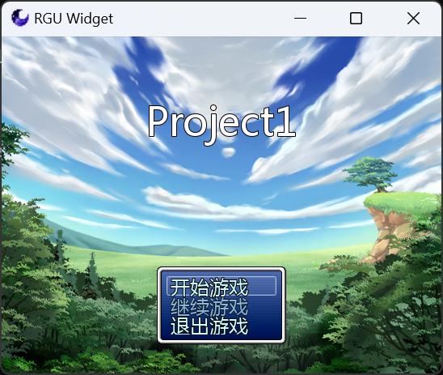
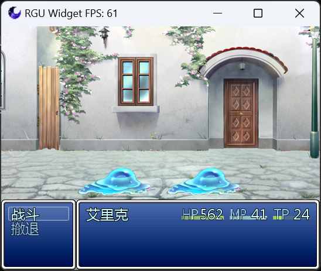
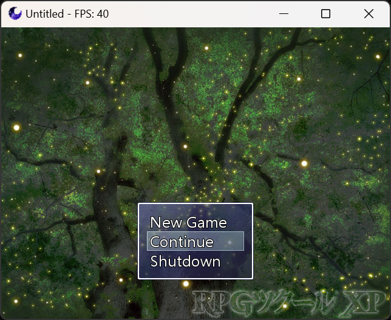
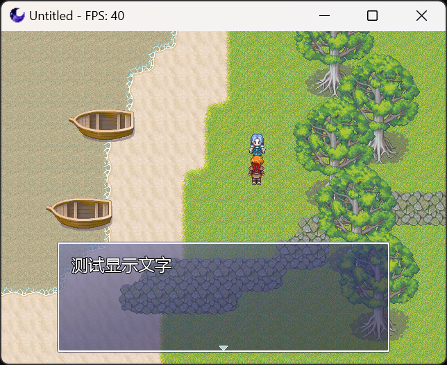
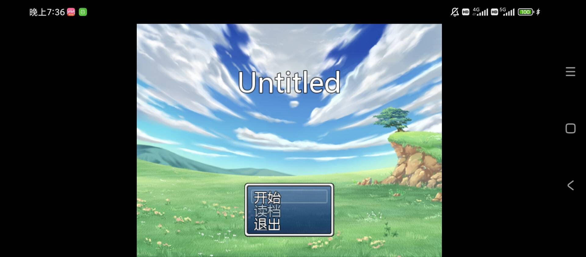

#  Universal Ruby Game Engine (in-progress)

## Overview

 - URGE is a 2D game engine compatible with RGSS 1/2/3, utilizing SDL3 as the foundation and DiligentEngine for the rendering component, which is designed for asynchronous multi-threading.  
 - URGE not only maintains compatibility with the original RGSS but also offers cross-platform support and performance enhancements. Additionally, it provides advanced features such as custom shaders and network extensions.  
 - This project is open-source under the BSD-2-Clause license.  

## Features

- Multi-thread: The program operates on a multi-threaded architecture, with several worker threads within the program. Each worker has an interface for task dispatching. The engine decomposes event handling, logic rendering, audio playback, video decoding, network processing, and other tasks into multiple threads.  
- Modern Graphics API: Game graphics rendering uses the DiligentCore which supports D3D11, D3D12, Vulkan and WebGPU natively to balance compatibility and graphics features.  
- Cross-platforms: The engine’s event input handling is based on SDL's event processing. The engine's audio processing is based on the SoLoud library. Audio data is processed by the SoLoud core and then output to SDL's audio device interface.  
- Highly efficient: The script processing part of the engine uses the Ruby 3 interpreter.  

## Screenshots

## Supported OS

- Microsoft Windows 7+  
- GNU/Linux  
- Android 14+  
- Emscripten/WASM

## 3rd party

### Include in Source
- SDL_image - https://github.com/libsdl-org/SDL_image  
- SDL_ttf - https://github.com/libsdl-org/SDL_ttf  
- fiber - https://github.com/paladin-t/fiber  
- dav1d - https://github.com/videolan/dav1d  
- rapidxml - https://rapidxml.sourceforge.net/  
- json - https://github.com/nlohmann/json  

### Reference on Project
- DiligentCore - https://github.com/DiligentGraphics/DiligentCore  
- SDL3 - https://github.com/libsdl-org/SDL  
- Physfs - https://github.com/icculus/physfs  
- freetype - https://github.com/freetype/freetype  

## Contact With

- AFDian: https://afdian.com/a/rguplayer
- Mail: admenri0504@gmail.com / admenri@qq.com

© 2015-2024 Admenri
